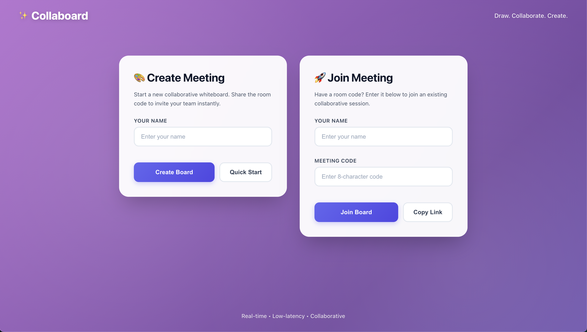
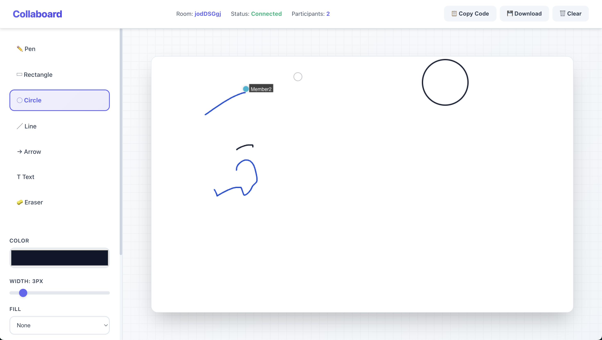

# 🎨 Collaboard  
### Real-Time Collaborative Whiteboard Platform

🔗 **Live Demo:** https://collaboard-delta.vercel.app/

Collaboard is a **real-time collaborative whiteboard application** that allows multiple users to create or join live sessions and interact simultaneously on a shared canvas. The project demonstrates **low-latency synchronization**, intuitive UI/UX, and a production-grade full-stack deployment.

---

## 🖼 Screenshots

### Homepage


### Whiteboard



## ✨ Key Features

- 🧑‍🤝‍🧑 **Real-Time Collaboration**  
  Multiple users can draw, write, and interact simultaneously using **WebSocket-based communication (Socket.IO)**.

- 🔑 **Room-Based Sessions**  
  Create or join whiteboard sessions using a **unique room code**.

- 🖱 **Live Cursor Presence**  
  See other users’ cursor movements in real time with **distinct colors and user labels**.

- 🎨 **Whiteboard Tools**
  - Freehand drawing
  - Shapes: Rectangle, Circle, Line
  - Text annotations
  - Eraser tool
  - Stroke styles: Solid, Dashed, Dotted
  - Adjustable stroke width and color

- 👥 **Participants Panel**  
  Displays active users with visual color indicators.

- ⚡ **Low-Latency Sync**  
  Event-driven architecture ensures near-instant updates across all connected clients.

- 🚀 **Production Deployment**
  - Frontend hosted on **Vercel**
  - Backend hosted on **Render**
  - Automated CI/CD via **GitHub**

---

## 🧠 Tech Stack

**Frontend**
- React.js
- Vite
- HTML5 Canvas
- CSS

**Backend**
- Node.js
- Express.js
- Socket.IO (WebSockets)

**Deployment & Tools**
- GitHub
- Vercel
- Render

---

## 📁 Project Structure

```text
collaboard/
│
├── client/                         # React + Vite frontend
│   ├── src/
│   │   ├── pages/
│   │   │   ├── Home.jsx            # Create / Join meeting UI
│   │   │   └── Room.jsx            # Whiteboard canvas
│   │   │
│   │   ├── App.jsx                 # Routing
│   │   ├── main.jsx                # React entry point
│   │   └── index.css               # Global styles
│   │
│   ├── index.html
│   ├── vite.config.js
│   └── package.json
│
├── server/                         # Node.js + Socket.IO backend
│   ├── index.js                    # Express + WebSocket server
│   └── package.json
│
├── assets/                         # Screenshots (optional)
│   ├── homepage.png
│   └── whiteboard.png
│
├── README.md
└── .gitignore

```

## Run locally

1. Start the server:
```bash
cd server
npm install
npm start
```

2. Start the client (in another terminal):
```bash
cd client
npm install
npm run dev
```

3. Open the Vite URL (usually http://localhost:5173)

## Notes
- Rooms and data are stored in memory; server restart clears rooms.
- Cursor updates are throttled to reduce bandwidth.
- This MVP focuses on UI/UX improvements; further polishing and persistence can be added next.


