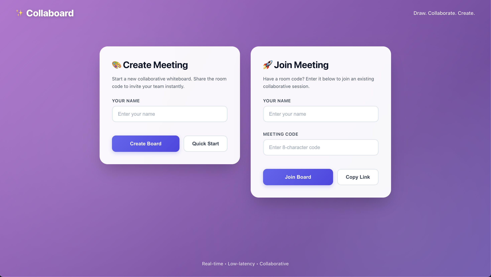
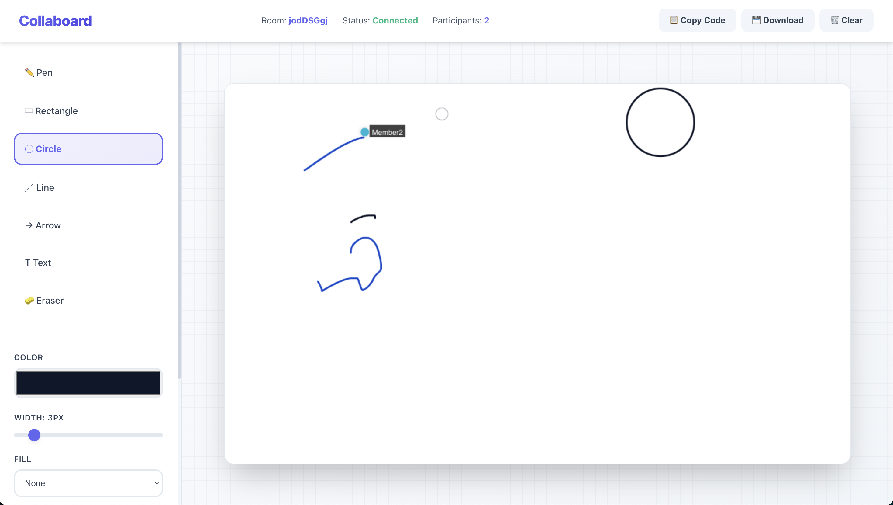

# 🎨 Collaboard  
### Real-Time Collaborative Whiteboard Platform

🔗 **Live Demo:** https://collaboard-delta.vercel.app/

Collaboard is a **real-time collaborative whiteboard** that allows multiple users to create or join live sessions and draw simultaneously on a shared canvas. It demonstrates **event-sourced persistence**, **distributed WebSocket scaling via Redis pub/sub**, and **server-authoritative collaborative undo/redo**.

---

## 🖼 Screenshots

### Homepage


### Whiteboard


---

## ✨ Key Features

- 🧑‍🤝‍🧑 **Real-Time Collaboration**  
  Multiple users draw, write, and interact simultaneously via **Socket.IO WebSockets** with Redis pub/sub — scales horizontally across server instances.

- 💾 **Persistent Board State**  
  Per-room draw events are stored as an **append-only log in PostgreSQL**. Full state is replayed on reconnect; no drawings are lost on server restart.

- ↩️ **Collaborative Undo/Redo**  
  Ctrl+Z / Ctrl+Y triggers a **server-authoritative undo** — the server re-projects the event log and broadcasts the canonical board state to all users in the room simultaneously.

- 🔑 **Room-Based Sessions**  
  Create or join whiteboard sessions using a unique room code (nanoid 8-char).

- 🖱 **Live Cursor Presence**  
  See other users' cursor movements in real time with distinct colors and labels. Throttled to reduce bandwidth.

- 🎨 **Whiteboard Tools**
  - Freehand drawing & Eraser
  - Shapes: Rectangle, Circle, Line, Arrow
  - Text annotations
  - Stroke styles: Solid, Dashed, Dotted
  - Adjustable stroke width and color

- 👥 **Participants Panel**  
  Displays active users with color indicators.

- 🗑️ **Automatic Room Cleanup**  
  A nightly cron job expires rooms inactive for > 7 days, keeping storage bounded.

- 🚀 **Production Deployment**
  - Frontend: **Vercel**
  - Backend: **Render**
  - Database: **Supabase (PostgreSQL)**
  - Cache/PubSub: **Upstash (Redis)**

---

## 🧠 Tech Stack

**Frontend**
- React 18, Vite, HTML5 Canvas API, React Router

**Backend**
- Node.js, Express.js, Socket.IO
- `@socket.io/redis-adapter` — cross-instance WebSocket broadcast
- `node-cron` — room GC scheduler

**Data Layer**
- **PostgreSQL** — append-only `draw_events` event log with per-room sequence counters
- **Redis** — pub/sub adapter for horizontal WebSocket scaling

**Deployment**
- GitHub → Render (backend), Vercel (frontend), Supabase (Postgres), Upstash (Redis)

---

## 📐 Architecture

```
Browser ──WebSocket──► Node Instance 1 ◄──pub/sub──► Redis ◄──pub/sub──► Node Instance 2
                              │                                                  │
                         INSERT event                                      INSERT event
                              │                                                  │
                              └─────────────────► PostgreSQL ◄──────────────────┘
                                                 draw_events
                                                 (append-only)
```

**Key design decisions:**
- **Append-only event log** (not a state blob) — concurrent draws are concurrent INSERTs, never conflicting read-modify-writes. Replay reconstructs any snapshot. Undo history is inherent.
- **Soft-delete undo** — events are marked `undone=TRUE`, never deleted. Redo flips the flag. Audit trail preserved.
- **Presence is ephemeral** — user lists stay in-memory intentionally. Presence doesn't need durability.

---

## 📁 Project Structure

```text
collaboard/
├── client/                         # React + Vite frontend
│   ├── src/
│   │   ├── pages/
│   │   │   ├── Home.jsx            # Create / Join meeting UI
│   │   │   └── Room.jsx            # Whiteboard canvas + undo/redo
│   │   ├── App.jsx                 # Routing
│   │   ├── main.jsx                # React entry point
│   │   └── index.css               # Global styles
│   ├── .env.example
│   ├── index.html
│   ├── vite.config.js
│   └── package.json
│
├── server/                         # Node.js backend
│   ├── index.js                    # Express + Socket.IO (bootstrapped)
│   ├── db/
│   │   ├── postgres.js             # PG connection pool
│   │   ├── redis.js                # Redis client factory (pub + sub)
│   │   └── migrations/
│   │       └── 001_init.sql        # Schema: rooms, draw_events, room_sequences
│   ├── services/
│   │   ├── roomService.js          # Room CRUD
│   │   └── eventService.js        # Event log + undo/redo projection
│   ├── jobs/
│   │   └── roomGC.js              # Nightly room expiry cron
│   ├── .env.example
│   └── package.json
│
├── assets/
├── docker-compose.yml              # Local Postgres + Redis
└── README.md
```

---

## 🚀 Run Locally

### Prerequisites
- [Docker](https://docker.com) (for Postgres + Redis)
- Node.js 18+

### 1. Start infrastructure
```bash
docker compose up -d
```
This starts Postgres on `:5432` and Redis on `:6379`.  
The migration (`001_init.sql`) runs automatically on first start.

### 2. Configure server
```bash
cp server/.env.example server/.env
# Edit server/.env if needed (defaults work with docker compose)
```

### 3. Start the server
```bash
cd server
npm install
npm start
```

### 4. Configure and start the client
```bash
cp client/.env.example client/.env
cd client
npm install
npm run dev
```

### 5. Open http://localhost:5173

---

## 🌐 Production Setup

| Service | Provider | Notes |
|---------|----------|-------|
| Frontend | Vercel | Auto-deploy on push to `main` |
| Backend | Render | Node.js service, `npm start` |
| Postgres | Supabase | 500MB free tier |
| Redis | Upstash | Serverless Redis, free tier |

**Render environment variables:**
```
DATABASE_URL   = <Supabase connection string>
REDIS_URL      = <Upstash Redis URL>
ALLOWED_ORIGIN = https://collaboard-delta.vercel.app
NODE_ENV       = production
ROOM_TTL_DAYS  = 7
```

**Run migration once on prod:**
```bash
psql $DATABASE_URL -f server/db/migrations/001_init.sql
```

---

## Notes
- Board state is persisted in PostgreSQL — server restarts do not clear rooms.
- Cursor updates are throttled (60ms) to reduce bandwidth.
- Rooms inactive for > 7 days are automatically purged by the nightly GC cron.
- Undo/redo is room-wide and server-authoritative — all users see the same state.
